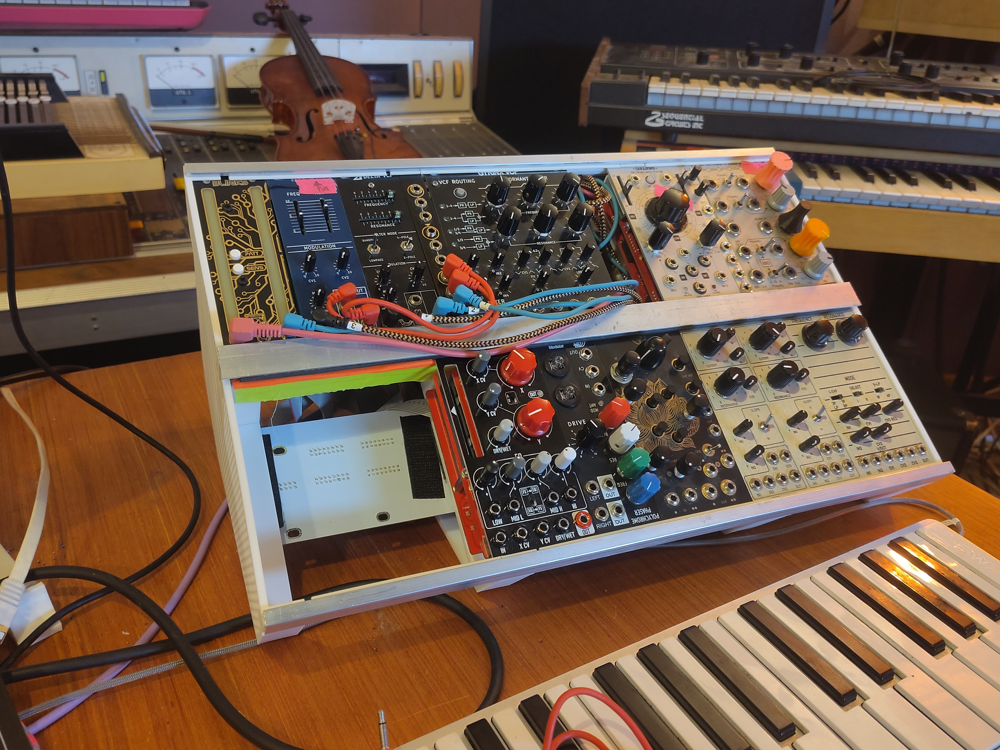
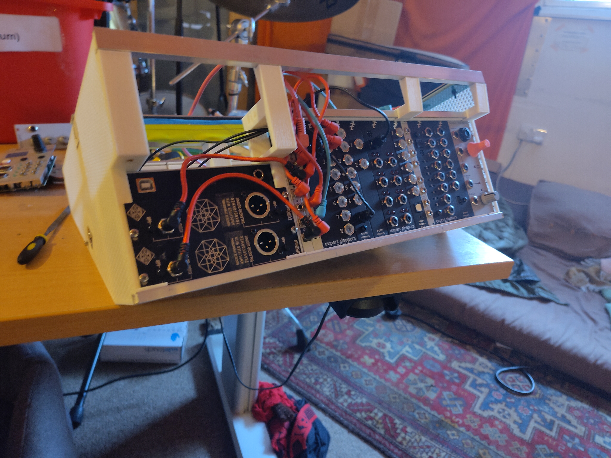
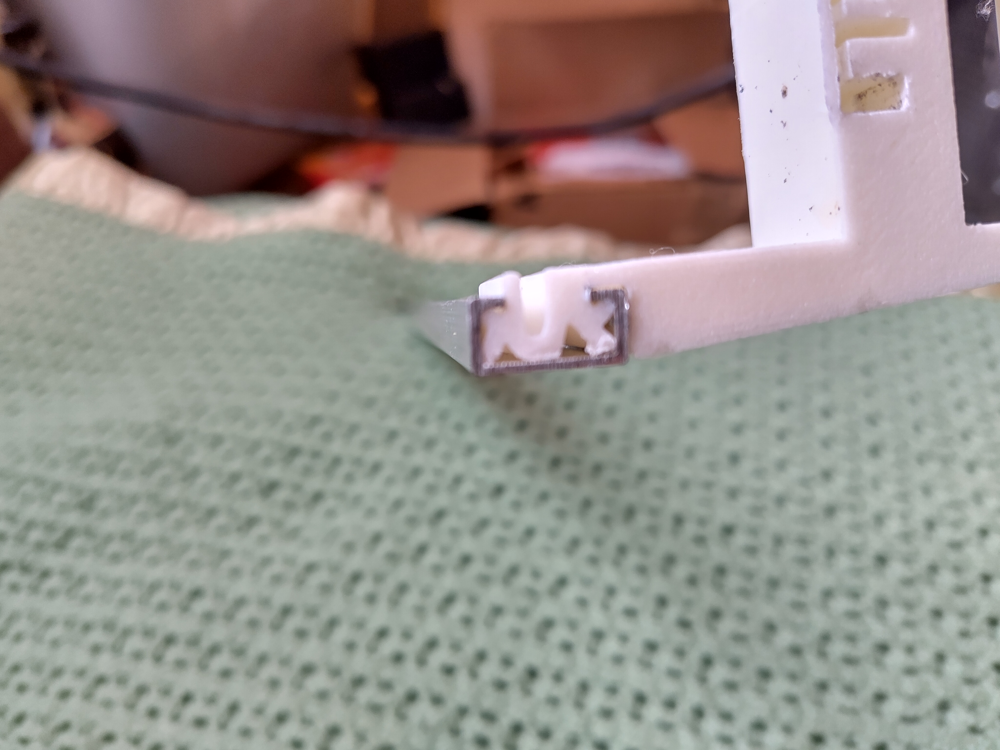
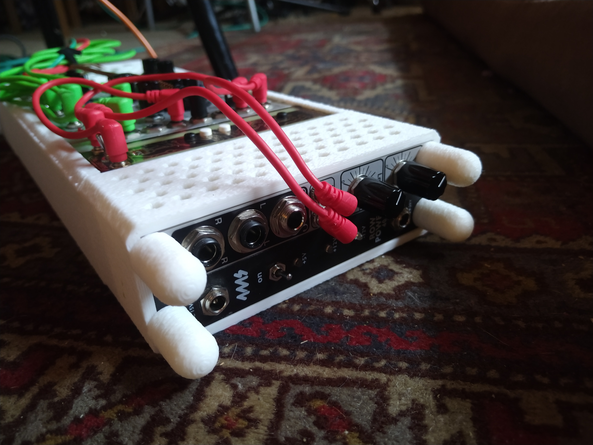
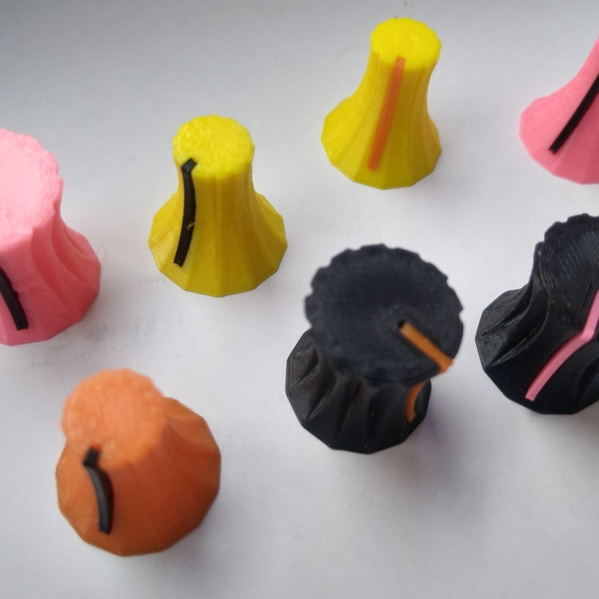

a dump of everything useful / music-related i ever print or make

TABLET PC - i built a tablet pc around high end desktop parts, mix of 3d print and milled parts from JLC3DP. i'll be using it for live shows (i built one before that's been the last few years touring, this is much better though.) mine has a AMD 9900X and the cooling manages a sustained 135W, cinebench says it's a bit faster than an M1 ultra mac studio (which costs 2x more than i spent on this build). freecad and stl files are there but contact me if you plan on building this one. pics coming soon.

MINIMUM WEDGE - this is the best one so far! a very very light, rigid, open frame modular case design, almost entirely screwless. 2 81HP rows and a back row with optional space for an RME digiface. this is my current tour case.

MINIMUM VIABLE MODULAR - a slim no-screws modular case design, with 8hp of utilities in either end and as much in the middle as you like. nice for people who want a few nice modules to use in a hybrid system with a computer

EXPERT SLEEPERS UNDERNEATH CASE - a large, no-screws (holding modules in) modular case, with two rows, a pair of speakers, and then 3x ES3 and 3x ES6 mounted underneath the case and some output modules in the side. designed around 2x mungo power mk1 boards. although it was rigid and popping modules in and out was easy and pleasant this one was way too heavy and i was worried about the ES modules underneath getting cooked. also i blew 2 dc-dc converters with the little speaker amp and i know how to fix that but it was a bad idea. free to a good home if anyone wants it!
.jpg)

EURO-KNOBS - a selection of largish knobs that work as a replacement for eg doepfer push on knobs. colour-coding your cutoff and resonance knobs (&etc) saves so much cognitive load, i recommend it.

